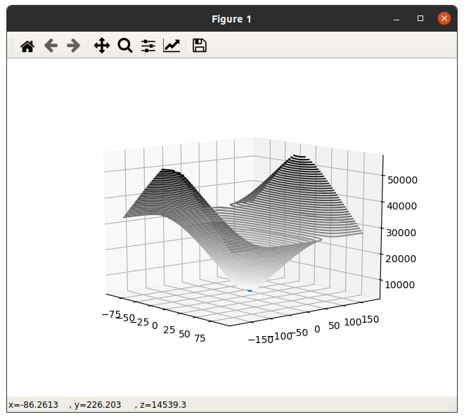

# "Geodesic median" - geometric median constrained to ellipsoid

## Definition of geometric median

The __Geometric median__ is "the point minimizing the sum of distances to the sample points" : https://en.wikipedia.org/wiki/Geometric_median

This definition applies to Eucliean spaces but can be generalized to Riemannian manifolds with corresponding distance function d(.,.). So the weighted geometric median along the manifold is defined as :

A distance constrained along a surface is called _geodesic distance_.

Let's consider the specific case of an ellipsoid in a three-dimensional space. It is useful for instance to solve the multi-facility location problem with the constraint to be moving only on Earth surface. Quite a common situation no?

Let's denote by _geodedic median_ the geometric median for such a situation.  

## Weiszfeld's algorithm in Cartesian coordinate system
Weiszfeld published in 1937 an algorithm to approximate the geometric median.

See https://github.com/scoutant/l1-median.

That approach applies to standard Cartesian coordinate system.

Now let's consider you are faced to a multi-facility location problem. 

You live on Earth, no? Most probably you will end in handling the locations of the target facilities with GPS __latitudes__ and __longitudes__.

## Spherical coordinate system - GPS latitude and longitude

The geographic coordinates *latitude* and *longitude* refers to a *spherical coordinate system* : 
https://en.wikipedia.org/wiki/Spherical_coordinate_system.

## Generalized Weiszfeld's algorithm with geodesic distance in a spherical coordinate system
With the GPS coordinate system we have a bijection (lat,lng)--location on ellipsoid. So we can compute against the 2 axis (latitude,longitude). And for corresponding projection on the ellipsoid we do compute the geodesic distances to the samples points.  

## GeoPy support to compute geodesic distances

We can use **GeoPy** support.
https://geopy.readthedocs.io/en/stable/#module-geopy.distance

Remember, the geodesic distance between 2 locations on Earth is the shortes distance along the ellipsoidal model of the Earth. Also named _great-circle distance_. 

Let's denote X the matrix holding the sample points. And y an estimate.

Let's mimic SciPy computation distance support. We can define function 'geodist' : computing all the distances for all the pair of the two collections of inputs, but using geodesic distance : 

So element-wise, the matrix of all the inverses of geodesic distance is :

    W = 1/geodist(X,[y])

## Geodesic median implementation in Python

With Python NumPy multi-dimensional array support, the expression of estimate is :

    np.sum(W*X,0)/np.sum(W)

sum(.,0) denotes that the sum is constrained to axis 0 : matrix sum operating only at point level.

We can iterator over until the distance between 2 consecutive estimates is less that a given error margin. Check geodesic_median.py. 

## Weighted geodesic median
You may be faced to a multi-facility location challenge where all the facilities do not have same importance.
To address that situation you can attach weights to the sample points.

We have functional weights corresponding to the importance of each sample point, let's denote WX that the collection of weights.
In addition, we have spatial weights relatively to current iteration itself : the inverse distances.

The combined weights can now be computed element-wise like so :

    W = WX/cdist(X,[y])

With that in mind the iteration estimate has same expression :

    np.sum(W*X,0)/np.sum(W)

## Local minima discussion
In a Euclidean space the sum of distances has an absolute minimum. Being a sum of convex functions.

This does not apply along a Riemannian manifolds. Not event on a sphere. Several minima are possible.

Consider 2 poles of a sphere. For all the points of the sphere the sum of geodesic distances is exactly half circumference.

Now consider the 2 locations (lat=0,lng=0) and (0,10). All the points of the geodesic segment will minimize the sum of distances. 

